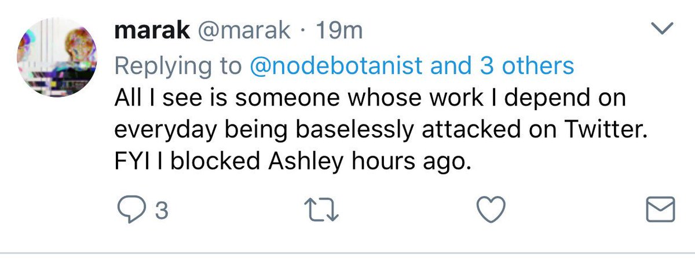

#[fit] Stop 
##the
#[fit]Fanaticism!

---

## Me

* DevRel @ IOpipe
* EE Student at ASU (Online)
* Nodebotanist (@nodebotanist)
* Non-Binary

---

## Catparent

---

# Warning!

We're gonna talk about some stuff:

* Bias
* Privilege
* Discrimination
* Fanaticism

And we're going to **really question these things.**

---

# Further Warnings

* nazism/facism (spoiler: I'm not a fan)
* descriptions of harassment
* I might yell a bit
* Also I'm gonna try not to curse but I might curse super sorry.

---

## Privileges

* White
* Cis-Passing
* Educated
* Employed
* Protected by a code of conduct

---

# [fit] So 
# [fit] what is 
# [fit] fanaticism?

---

# [fit] Unquestioned, unadulterated passion for something.

---

##[fit] Wait...
##[fit] so you're saying 
#[fit] **passion is bad?!**

---

## [fit] Hang on...
### [fit] Let me do some reformatting here...

---

# [fit] Unquestioned
# [fit] Unadulterated
### [fit] passion for something

---

# [fit] I am passionate for passion!

---

## [fit] My problems lie with the
# [fit] UnQuestioned,
# [fit] unadulterated
## [fit] part. 

---

# [fit] So the last time I gave this talk was
# [fit] Two years ago.

---

## Back then...

* We had fights over frameworks all the time
* We had to fight for codes of conduct at events
* We had serious problems with idolizing jerks

---

# [fit] But now, it's 
# [fit] 2017!

---

# [fit] so it's gotten a lot better.
# [fit] ...Right?

---

# [fit] Not so much.

---

## We still have a ton of fighting about tools and frameworks and laguages

**Seriously, stop making fun of PHP**

---

##  We still have the code of conduct argument on an exceedingly regular basis

---

# We still have people clinging to debunked psudoscience in order to justify discrimination 

* James Damore's maifesto
* Anti-Transgender advocates
* I'm sure there's something going on right this second on Twitter

---

## And in my home country, we have actual literal Nazis marching freely through the streets and murdering counter-protestors, and a president that refuses to condemn them.

### (that's on top of all the stuff happening in tech)

---

# Um, isn't this about code?

It is, and we'll get to that. But at the same time, I defer to the fantastic CJ Silverio:

---

### Counter: But what do social issues have to do with tech?

# [fit] **EVERTHING.**

---

# Let's take a look at how fanaticism manifests itself

* Cliques and "Culture Fit"
* Tropes
* Jerk Worship
* Code as a person's value

---

# If you're thinking 'that sounds an awful lot like high school'...you're not alone there.

---

# cliques

* Tend to form around languages, frameworks, and semicolon usage
* "When all you have is a hammer, everything is a nail"
* Also, people who don't use your hammer are doing it wrong.
* Also, they aren't good coders

---

# how they affect our code

* Monolithic frameworks 
* 10MB static sites because why not use Ember/Angular/whatever to get this done "quickly"
* Bikesheds as far as the eye can see

---

# how they affect our culture

* New programmers are caught in a seemingly life-or-death decision.
* Try something new? Get ready for "just joking" contempt.
* Ever ask a question about x to be told "just use y"?
* "Contempt Culture" (read more [here](http://blog.aurynn.com/contempt-culture-2))

---

# Oh but it gets better

Let's talk about "culture fit" for a bit.

---

# What is culture fit?

Ideally: making sure a new addition to the team continues to foster a challenging but safe environment for the entire team, including the new addition

In reality: what we tell rejected applicants when they threaten the status quo or might make us uncomfortable with our own behavior or privilege.

---

# What?

Marginalized groups are often singled out of tech positions (especially leadership positions) in dicrminatory ways, intentionally or otherwise, using the Culture Fit excuse.

It's insidious because it's impossible to legally prosecute and it has warped a legitimate concern into a way to keep tech homogenous.

---

## When your culture is garbage, and you optimize for culture fit...

---

# Tropes

* The "stereotypical progammer"
* Allows us to "be who we are" without being questioned
* ...including being jerks.

---

# How they affect our code

* "We do this because it's [language]."
* "This is how it's done"
* "Let's make fun of PHP because everyone else does"

---

### [fit] not to mention that more and more studies show...
# [fit] Diverse companies do better.
### [fit] so homogenous tropes = missed potential!

---

# How these affect our culture

* Feeds into culture fit and tech homogeny
* Great way to play down someone's actual tech credentials when they don't fit the trope
* Alienates both new and veteran developers for completely arbitrary reasons

---

# Tropes feed into tech homogeny

One way is brought about by the question "But Kas, aren't these stereotypes about developers there because the most succesful developers match them?"

---

# It's the other way around

The most sucessful people in tech have made it because they fit the trope and happen to also be good at code.

---

# But how do we know this?

Study after study shows that the traits that these tropes celebrate:

* Assertiveness
* Tenacity
* Out-of-the-box thinking
* Questioning authority and tradition

---

# These traits are 
# only seen positively
# [fit] in young 
# [fit] cis-hetero
# [fit] white
# [fit] men

---

# These same traits seen in women:

* Bossy
* Naggy
* Not seeing the solution
* Disruptive (and not startup disruptive)

---

# The tech community is represented by these tropes
# because we made sure it is.

---

# Kitten Break!

---

# Jerk Worship

This is the one that makes me the angriest because it's the most prevelant and least changing

---

# What do you think is the thing I did in tech that has caused me the most grief?

* Debug JS (not really)
* Gave a talk at a tech conf and said something incorrect (getting there)
* Said I didn't use semicolons (close!)

---

# I said I wouldn't speak at conferences with Douglas Crokford anymore.

---

# What I said

Don't invite me if you're inviting him, I don't want to put myself in that situation.

And I called him a jerk and provided examples of his behavior I found jerky.

---

# What I didn't say (but people said I said)

* Don't invite Crockford to things
* Crockford harassed me or others
* Crockford is not a good programmer

---

People who worshipped and or very much liked Crockford's technical work assailed me with insults, insinuations that I'm not a good programmer or speaker, contacted my employer to say I was a bully, sent me physical threats on my health, body and life...and that's just a summation

---

# And that was before he was dropped from a conference that I had already bowed out of quietly.

---

# How idol worship affects our code

* We follow those we idolize without thinking about whether their solution matches our problem
* We show contempt for tools that our idols don't use.
* We try to make their solutions our own.

---

# How it affects our culture

* If we idolize folks who are jerks to new people, we can drive them away
* If we idolize those who espouse bigoted, racist, or otherwise discriminatory views, we are complicit in their discrimanation.

---

# Yes, you heard me

If you idolize a racist, a bigot, or a discriminatory figure because you like their code,

**you are complicit in it.**

---

# My theory

We don't need jerks in tech because they code well.

**I stand by the theory that if you foster a good evnironment for empathy and all people, *good code will follow***

---

# Rascists in my home country like to yell that they will not be replaced.

## Let's prove them wrong.

---

# Doggo Break

---

# Code as a person's value

This is the idea that the validity and worth of your argument in any arena is tightly bound to the amount of code you have pushed and the amount it is used by other people.

---

# It's
# [fit] Bullshit.

 

---

# This actually happened

(during the CoC argument mentioned earlier)

* Friend: "This is garbage"
* Third Party: "His code is used by millions of people each day."
* Me: "Why does that matter?"
* Another friend: "If you use npm, you use friend's code."

---

# This actually happened (cont.)

* Third Party: "I don't use npm and how could friend write npm, Issac did"
* Me: "BUT SERIOUSLY THO WHY DOES THAT MATTER!?"
* Third party: "I read friend's timeline, she must be on drugs or mentally ill because she has corgi pictures."
* Me: ...are you...are you serious?
* [I was blocked at this point]

---

# No. seriously. This happened.

---

# No. seriously. This happened.

---

# No. seriously. This happened.

---

# THIS IS 2017. 

---

# A person's code is not their only valuable trait

* Their perspectives and experiences
* Their acts to educate others
* Their contributions to documentation
* Their goals and solutions to problems
* Their empathy

---

# measuring your worth in code makes me question your self-esteem

---

## Seeing you measure other's worth in code makes me question your humanity and capability for empathy.

---

# You are not your code. You are so much more than that. And so is everyone else.

---

# Red Panda Break

---

# [fit] So how do we combat this?

---

# Passion.

Passion is great! Passion leads us to:

* Educate
* Write cool stuff (and share it!)
* Learn new things
* Work together

---

# Be passionate in the things you do. But don't be fanatic

* Don't judge others for not sharing your passions. Their code style or language, their hobbies, their clothing
* Share knowledge about the things that you love! But also learn about things you don't know before dismissing it!

---

# Be passionate in calling out bad behavior in others, in creating a better community for you and others.

---

## That's all well and good, Kas, but I need actual calls to action. Like, specific ones.

---

# [fit] Okay.

---

# Hiring managers

Without whining about how hard it is, or making a big deal about how awesome you are after doing it...

# Hire someone different than you.

---

# Privileged folks

Hear a joke about a group of people not represented or underrepresented in the room?

# Call that garbage out loudly.

(and don't ask for a thank you or award or parade for doing the right thing)

---

# big secret: The more privileged you are, the less will happen to you when you call it out.

---

# Underrepresented folks in tech

You keep being awesome, practice self-care, and don't let people force you into doing their emotional labor. 

Don't feel like you owe anyone for calling out bad behavior, and no one's judging you for keeping your head down.

---

# We all have to work together to right this ship.

---

# It's almost never easy to do the right thing, and you probably won't got a parade for doing it

---

# [fit] do it anyways.

---

### Do it for all of the amazing people we've chased out of tech, and all the amazing people we scared away before they even joined, and all of the lost potential.

---

## [fit] Do it because
# [fit] it's the right thing to do.

---

# Thanks!

@nodebotanist on Twitter, GitHub
the@nodebotani.st

---

# I will now take questions, but note:

* If your "question" is really just an opinion or statement, I'll probably cut you off
* If your "question" violates the Code of Conduct, you're not gonna like my response
* If your "question" is about me personally, I'll tell you to talk to me after. Don't push it.
* I am not obligated to educate you on things easily found online

---

# Thanks again!

@nodebotanist on Twitter, GitHub
the@nodebotani.st

